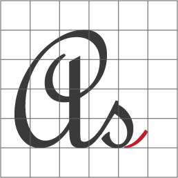

# Electronic project archive

Electronic and software infrastructure; Includes simple examples to understand in the simplest way.

## Project

* Hardware : Micro Computer
* Language : 1 / 0
* Programming : 8 Bit  
* Input : Push Button * 3
* Output : 8 Segment Digit LED Display
* Energy requirement : Min 2V

## Projects

* [Debouncer](project/Debouncer/README.md)
* [Micro Controller](project/MicroControllers/README.md)
* [Micro Controller - Micro Computer](project/MicroControllers/8BitMicroController/README.md)
* [8 Bit Register](project/Register/README.md)
* [Timer](project/Timer/README.md)

## Datasheets

* [Datasheets](docs/ref/README.md)