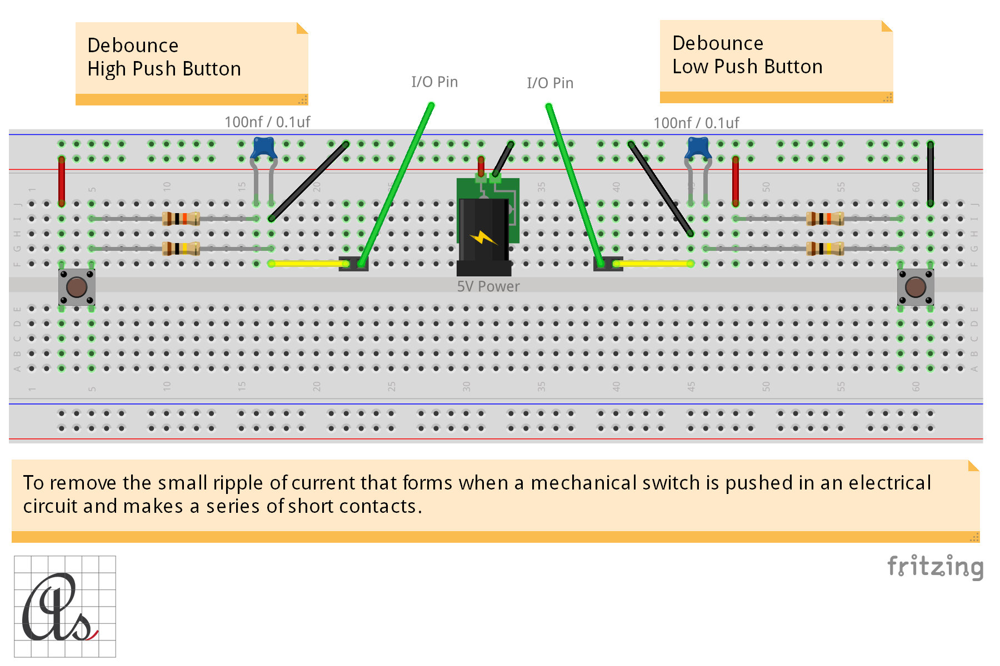

# Debouncer

* Debounce High Push Button
* Debounce Low Push Button

## Serial communication

* signal
* clock
* switch

To remove the small ripple of current that forms when a mechanical switch is pushed in an electrical circuit and makes a series of short contacts.

 [Fritzing](http://fritzing.org/download/) is an open-source hardware initiative that makes electronics accessible as a creative material for anyone.
