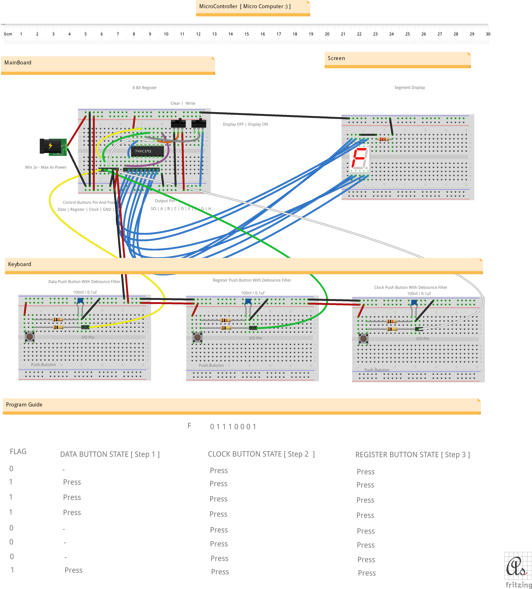

# Micro Controller - Micro Computer 

* 8 Bit Screen
* 8 Bit Memory
* 3 Key Keyboard
* Min 2 V (DC ) Power

 [Fritzing](http://fritzing.org/download/) is an open-source hardware initiative that makes electronics accessible as a creative material for anyone.