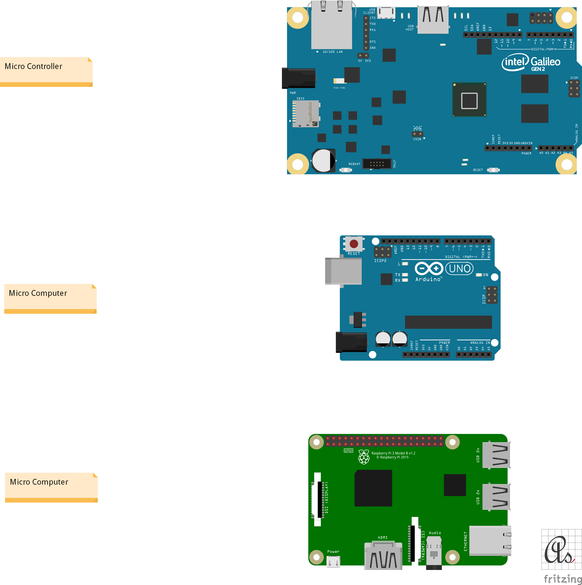

# Micro Controller

* Arduino Uno (Rev3)
* Intel Galileo
* Raspberry Pi 3

 [Fritzing](http://fritzing.org/download/) is an open-source hardware initiative that makes electronics accessible as a creative material for anyone.