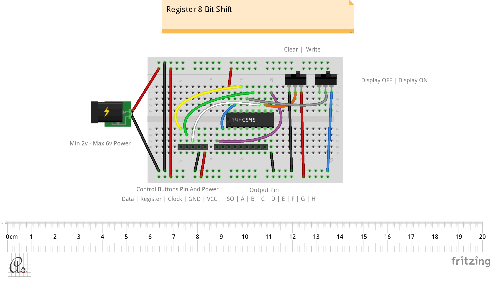

# 8 Bit Register

* Serial In, Parallel Out Shift register
* Wide Operating Voltage Range of 2 V to 6 V 
* Shift Register Has Direct Clear
* Can be expanded with serial output [SO Pin ].

 [Fritzing](http://fritzing.org/download/) is an open-source hardware initiative that makes electronics accessible as a creative material for anyone.